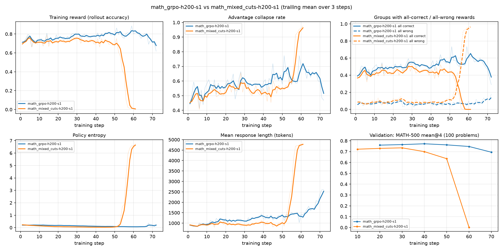

# GRPO vs Mixed-CUTS on Qwen3-1.7B: H200 results (1 October 2026)

Both arms trained in parallel on one 2x H200 Jarvislabs spot instance (one GPU per arm) with the recipe of
decision 013: Qwen3-1.7B non-thinking, LoRA r=64 alpha=128 on all linear layers, lr 1e-5 constant, bf16,
128 prompts x 16 rollouts per step (Mixed-CUTS: 8 standard + 8 CUTS), mini-batch 32, 5,000-token responses,
low-var KL loss 1e-3, single seed. Both arms improved, then diverged; they were stopped at GRPO step 72 and
Mixed-CUTS step 61 and evaluated at equal steps (decision 016).

## Evaluation

pass@1 in %, 16 samples per problem (temperature 1.0, top-p 0.8, top-k 20, 5,000 tokens), bootstrap 95% CI
in [`comparison/comparison.md`](comparison/comparison.md); every checkpoint and metric (maj@16, pass@16,
lengths, truncation) in [`comparison/eval_all_checkpoints.md`](comparison/eval_all_checkpoints.md).

| Model | MATH-500 | AIME24 | AIME25 | AMC23 | GPQA-Diamond |
|---|---|---|---|---|---|
| Qwen3-1.7B (base) | 70.2 | 13.8 | 10.6 | 42.8 | 32.9 |
| GRPO, step 40 | **78.1** | **23.5** | **15.8** | **53.0** | **35.4** |
| Mixed-CUTS, step 40 | 71.5 | 16.0 | 6.7 | 43.1 | 31.5 |
| Mixed-CUTS, step 50 | 67.4 | 8.5 | 3.5 | 34.4 | 33.0 |

AIME24/25 have 30 problems each (CIs about +-10 points). GRPO's answers are much longer (55% of its AIME24
samples hit the 5,000-token cap) and still score higher. pass@16 barely moves on MATH-500 (91.2 base, 91.4
GRPO): training made the model more reliable rather than solving new problems.

## Training

Validation during training: 100 MATH-500 problems, 4 samples each (`val-core/math500/reward/mean@4`).

| Step | 0 | 10 | 20 | 30 | 40 | 50 | 60 | 70 |
|---|---|---|---|---|---|---|---|---|
| GRPO | 70.8 | 73.0 | 76.0 | 76.5 | **77.3** | 76.3 | 74.8 | 69.5 |
| Mixed-CUTS | 70.5 | 72.3 | 73.0 | **73.5** | 70.0 | 63.5 | 0.3 | |



* **Mixed-CUTS** trails GRPO from the first steps. Its entropy fell to ~0.04 (GRPO ~0.12) while its KL to the
  reference rose to ~0.17 (GRPO ~0.06) by step 45; from step ~48 entropy, KL and response length exploded and
  by step 56 the policy produced near-random text (entropy 6.8, 94% of responses truncated, validation 0.3%).
  Standard and CUTS rollouts degraded together, so the policy itself collapsed.
* **GRPO** followed the same pattern about 15 steps later: KL rose steadily, then from step ~64 response length
  (1,430 to 2,600 tokens), truncation (12% to 37%) and KL (0.15 to 1.05) blew up and validation fell to 69.5%.
* The shared failure mode points at the shared recipe rather than CUTS alone. The cause is not established;
  one candidate is the bf16 rollout/training probability mismatch that truncated importance sampling
  corrects, which the brief turned off (decision 001).
* The stability watch (decision 006) did not alert: its entropy rule only covers collapse in the first 20
  steps, and the gradient norm (~1) stayed far below its limits.

## Compute

| | GRPO | Mixed-CUTS |
|---|---|---|
| Logged training steps | 71 (1 to 72; step 10's row lost) | 61 |
| Training GPU-hours (sum of step times) | 10.2 | 10.3 |
| Active wall-clock hours | 11.1 | 11.2 |

The INR 5,880 course credit (2x H200 spot at ~INR 379/h, ~15.5 billed hours) covered about INR 3,900 of
training steps; the rest went to setup and smoke tests, model loading and validation on every (re)start,
idle time around two spot interruptions, and about an hour of evaluation. The first steps took ~18 minutes
until length-sorted micro-batches (decision 015) made the training passes ~4x faster.

## What is where

* This folder: per-step metrics (`training/<run>/metrics.jsonl`), phase timings, launcher logs, the last
  preflight of each run, evaluation metrics (`eval/<model>/<checkpoint>/<benchmark>/results.json`), tables,
  figures, and the two ad hoc scripts used on the instance (`ops/`: checkpoint keeper, evaluation queue).
* Hugging Face (private): `lokola13/mixed-cuts-h200-runs`: LoRA weights of GRPO steps 10, 40, 50, 60,
  70, 71, 72 and Mixed-CUTS steps 40, 50, 60, 61 (no optimizer states), every generated evaluation answer
  (`samples.jsonl`), rollout dumps, CUTS statistics, GPU memory traces, full trainer logs, smoke runs.
* W&B: `anlp-mixed-cuts/mixed-cuts`, runs `math_grpo-h200-s1` and `math_mixed_cuts-h200-s1` (tagged
  `h200`, `final`). Steps missing from the W&B charts (lost to the spot pauses, a restart and the final stop):
  GRPO 1, 9, 21, 22; Mixed-CUTS 3, 9, 22. They are in each run's `*-complete-record` artifact and here.

## Not evaluated

* Both step-22 checkpoints: their weights were pruned when the runs were stopped (only the checkpoint
  keeper's copies at steps 10/40/50/60/70 survived).
* GRPO step 50: `run_eval.py` aborts when any response contains a think tag
  (`mixed_cuts.thinking.check_non_thinking`); 9 of its 8,000 MATH-500 answers did, with every prompt correctly
  in non-thinking mode. The check needs a tolerance before this checkpoint can be scored.

## Reproducing the tables

```bash
# merge a checkpoint (from the Hugging Face repo) into a vLLM-loadable model
MC_MODEL_DIR=<Qwen3-1.7B dir> MC_MERGE_DTYPE=bfloat16 bash scripts/merge_ckpt.sh <checkpoints/math_grpo-h200-s1> 40
# tables and figures from run dirs laid out as on the instance
python scripts/compare_runs.py --runs-dir <runs> --runs math_grpo-h200-s1 math_mixed_cuts-h200-s1 --base base-qwen3-1.7b-h200
python scripts/plot_runs.py --runs-dir <runs> --runs math_grpo-h200-s1 math_mixed_cuts-h200-s1 --smooth 3
```

`comparison/comparison.md` was generated from a view holding only step 40 of each run, so its evaluation
table compares equal steps (the script otherwise picks each run's newest evaluated checkpoint).
